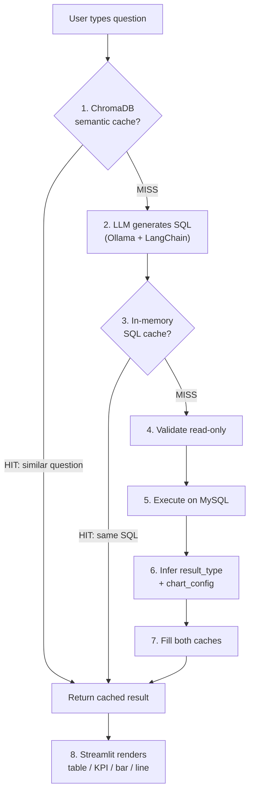

# Healthcare AI Assistant -- Architecture

A **fully local, privacy-first text-to-SQL assistant** for healthcare staff. Users type plain English questions (e.g., "How many patients were admitted last week?") and get back tables, KPI cards, or charts -- without writing any SQL, and without data ever leaving the infrastructure.

---

## Repository Structure

```
healthcare-ai/
├── backend/
│   ├── text_to_sql.py     # LangChain + Ollama: NL question -> SELECT statement
│   ├── sql_guards.py      # Data-driven post-generation SQL correction engine
│   ├── sql_executor.py    # Validates read-only, executes against MySQL
│   ├── schema.py          # Introspects MySQL schema (no row data sent to LLM)
│   ├── result_metadata.py # Infers result_type (table/kpi/bar/line) from data shape
│   ├── query.py           # Orchestrates: generate SQL -> execute -> metadata
│   ├── cache.py           # Two-tier cache + demo mode + audit integration
│   └── audit.py           # JSONL audit log (no PII)
├── config/
│   ├── settings.py        # All config from .env with typed defaults
│   └── sql_guards.yaml    # Declarative SQL post-generation guard rules
├── docker/mysql/
│   ├── 01-init.sql        # Schema: departments, patients, appointments, visits
│   ├── 02-readonly-user.sql
│   └── 03-seed-100.sql    # 100-row seed data
├── tests/
│   ├── test_sql_generation.py  # SQL quality + safety tests
│   └── test_cache_behavior.py  # Semantic cache correctness
├── streamlit_app.py       # UI: text input -> adaptive rendering
├── docker-compose.yml     # App + MySQL + Ollama (one-command stack)
├── Dockerfile             # Python 3.12-slim, Streamlit server
└── run_demo.py            # Demo mode launcher (no dependencies needed)
```

---

## Architecture & Data Flow

The system follows a linear pipeline with two cache bypass points:



### Layer-by-layer breakdown

**1. UI Layer** -- `streamlit_app.py`

- Single text input field; user types a natural-language question.
- Calls `query_with_cache()` and inspects the `result_type` field in the response.
- Renders adaptively: `st.metric` for KPIs, `px.bar`/`px.line` for charts, `st.dataframe` for tables.
- Shows generated SQL in a collapsible expander, cache status badge, and row count.

**2. Cache Layer** -- `backend/cache.py`

- **ChromaDB semantic cache** (checked BEFORE the LLM call): embeds the question with `nomic-embed-text`, queries the vector store. Hit only if cosine similarity >= 0.95 AND entry is within TTL. This skips the expensive LLM round-trip entirely.
- **In-memory SQL cache** (checked AFTER SQL generation): keyed by normalized SQL. Skips the DB round-trip when the LLM generates the same SQL as a recent query.
- Both caches are TTL-bounded (default 300s). On miss, both layers are filled.

**3. Text-to-SQL** -- `backend/text_to_sql.py`

- Uses LangChain `ChatPromptTemplate` with a system prompt containing the schema string and semantic hints (e.g., "admitted" means `visits`, not `appointments`).
- LLM is `ChatOllama` (llama3.2) at temperature=0 for deterministic output.
- Includes a post-generation guard: if the question is about admissions in a time window but the LLM produces a wrong JOIN, a hardcoded correct SQL is substituted.
- `_extract_sql()` strips markdown fences if the LLM wraps the SQL.

**4. Schema Introspection** -- `backend/schema.py`

- Queries `information_schema.COLUMNS` and `KEY_COLUMN_USAGE` at runtime.
- Returns a compact string like `Table patients: id (int), first_name (varchar), ...` with FK references.
- **No row data** is ever sent to the LLM -- only structure.

**5. SQL Execution** -- `backend/sql_executor.py`

- `validate_read_only()`: rejects anything that isn't a single SELECT; regex-checks for INSERT/UPDATE/DELETE/DROP etc.
- `execute_select()`: runs the normalized SQL via PyMySQL with `DictCursor`, caps results at `MAX_QUERY_ROWS` (500).

**6. Result Metadata** -- `backend/result_metadata.py`

- Inspects the DataFrame shape to auto-classify: 1 row x 1 col = KPI; 2 cols with categorical+numeric = bar chart; date+numeric = line chart; everything else = table.
- Generates `chart_config` with `x_column`, `y_column`, `title` for Plotly.

**7. Audit** -- `backend/audit.py`

- Every query (cached or fresh) is appended to a JSONL file with timestamp, session_id, question (truncated), SQL, result_type, row_count, duration, and error. No PII logged.

**8. Orchestration** -- `backend/query.py`

- `run_query()` is the "no-cache" path: generate SQL -> execute -> attach metadata. Returns a standardized response dict.
- `query_with_cache()` in `cache.py` wraps `run_query()` with the two cache layers and audit.

---

## Architectural Choices, Benefits & Tradeoffs

### 1. Fully local LLM (Ollama) -- no cloud APIs

- **Benefit:** Complete data sovereignty. Healthcare data (even query text) never leaves the network. No API keys, no usage billing, no vendor lock-in.
- **Tradeoff:** Requires GPU or capable CPU on-premise. Model quality (llama3.2) is lower than GPT-4-class models -- compensated by a tightly constrained prompt and post-generation guards.

### 2. Schema-only context (no row data to LLM)

- **Benefit:** The LLM never sees patient records, names, or dates. Even if the model were compromised, no PHI leaks.
- **Tradeoff:** The LLM can't do few-shot learning from actual data distribution. It may generate valid-syntax SQL that returns unexpected results for edge cases.

### 3. Two-tier caching (semantic + SQL-level)

- **Benefit:** ChromaDB catches rephrased questions ("how many admitted" vs "count of admissions") before the LLM runs (~seconds saved). In-memory cache catches identical SQL after LLM runs (~milliseconds saved on DB).
- **Tradeoff:** Two cache invalidation surfaces. TTL-only expiration means stale data is possible within the window. No active invalidation on DB changes.

### 4. Read-only enforcement (regex + DB user)

- **Benefit:** Defense in depth -- SQL is validated in Python AND the MySQL user only has SELECT grants. Even a prompt injection that tricks the LLM into producing DELETE is blocked at both layers.
- **Tradeoff:** Regex-based validation could theoretically be bypassed by exotic SQL syntax. The DB-level grant is the true safety net.

### 5. Automatic result_type inference with manual override

- **Benefit:** Zero-config visualization by default. The system infers KPI/bar/line/table from the query result shape. A "Display as" selector in the UI lets users override the inferred type to any of the four options (Table, KPI Card, Bar Chart, Line Chart) without re-running the query.
- **Tradeoff:** Heuristic-based inference can still be wrong on first render. The override is per-question and per-session (not persisted across page reloads).

### 6. Streamlit for UI

- **Benefit:** Extremely fast to build. Rich widget library (metrics, charts, dataframes) with minimal code (~96 lines). Hot reload for development.
- **Tradeoff:** Limited customization. Not suitable for multi-user production with authentication/RBAC. Each browser tab is a separate session with no shared state.

### 7. Docker Compose for full stack

- **Benefit:** One-command setup (`docker compose up -d`). MySQL auto-seeds, health checks ensure ordering. Ollama persists models in a named volume.
- **Tradeoff:** Ollama models must be pulled separately after first start. The app container depends on Ollama being "started" (not "healthy with models loaded"), so first query may fail if models aren't ready.

### 8. Data-driven SQL guards (`config/sql_guards.yaml`)

- **Benefit:** Post-generation rules that catch known LLM mistakes are defined in YAML, not code. Adding a new guard means adding a block to the YAML file -- no Python changes required. Each rule declares: question patterns to match, SQL patterns that indicate a bad query, and fallback SQL variants keyed by question phrases.
- **Tradeoff:** YAML rules are still pattern-matched strings, not full semantic understanding. Complex conditions may outgrow the current `all_present` / `any_missing` vocabulary and require extending the guard engine.

---

## Tech Stack Summary

| Layer | Technology | Why |
|---|---|---|
| **UI** | **Streamlit** | Rapid prototyping of data apps. Built-in widgets for tables, metrics, and Plotly chart integration. |
| **LLM** | **Ollama (llama3.2)** | Runs locally, no cloud dependency. Open-source, supports many model families. |
| **Orchestration** | **LangChain + LangChain-Ollama** | Provides prompt templates, output parsers, and composable chains for the text-to-SQL pipeline. |
| **Embeddings** | **Ollama (nomic-embed-text)** | Local embedding model for the semantic cache. No external API calls. |
| **Vector Store** | **ChromaDB** | Lightweight, file-persisted vector DB for semantic similarity search on cached questions. |
| **Database** | **MySQL 8.0** | Widely used in healthcare. Read-only user with SELECT-only grants. |
| **DB Driver** | **PyMySQL** | Pure-Python MySQL client. No C extensions needed, simplifies Docker builds. |
| **Data** | **Pandas** | DataFrame operations for result type inference and Streamlit rendering. |
| **Charts** | **Plotly Express** | Interactive charts (bar, line) that integrate natively with Streamlit. |
| **Config** | **python-dotenv** | Loads `.env` for secrets/config without hardcoding. |
| **Audit** | **JSONL file** | Simple append-only log. No external dependency. Easy to grep/parse. |
| **Containerization** | **Docker + Docker Compose** | Reproducible environment. Three services (app, MySQL, Ollama) with health checks and volume persistence. |

---

## Database Schema (4 tables)

```
departments (id, name, created_at)
patients    (id, first_name, last_name, date_of_birth, created_at)
appointments(id, patient_id->patients, department_id->departments, scheduled_at, status, created_at)
visits      (id, patient_id->patients, department_id->departments, visit_date, notes, created_at)
```

The schema is intentionally small -- designed to demonstrate the text-to-SQL pipeline on realistic healthcare concepts (admissions, appointments, departments) without complexity.

---

## Testing

- **`tests/test_sql_generation.py`:** Integration tests that run against the live Docker stack. Validates that generated SQL is valid SELECT, uses correct tables (visits for admissions, patients for names), and that adversarial questions ("Delete all patients") still produce safe SQL.
- **`tests/test_cache_behavior.py`:** Verifies ChromaDB doesn't return false positives (gibberish "asda" shouldn't match real questions), same questions DO cache, and the `from_cache` flag behaves correctly.

---

## Demo Mode

Setting `DEMO_MODE=1` bypasses MySQL and Ollama entirely. `_demo_response()` in `cache.py` returns hardcoded mock data based on keyword matching ("count" -> KPI, "by department" -> bar chart, else -> table). This lets anyone try the UI without any infrastructure.
