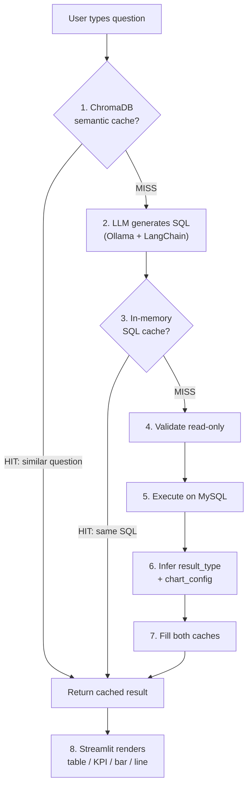

# Healthcare AI Assistant — Architecture & Data Flow

A fully local, privacy-first text-to-SQL assistant for healthcare staff. Users type plain English questions (e.g., "How many patients were admitted last week?") and get back tables, KPI cards, or charts — without writing any SQL, and without data ever leaving the infrastructure.

---

## Repository Structure (logical view)

```text
healthcare-ai/
├── backend/
│   ├── text_to_sql.py     # LangChain + Ollama: NL question -> SELECT statement
│   ├── sql_guards.py      # Data-driven post-generation SQL correction engine
│   ├── sql_executor.py    # Validates read-only, executes against MySQL
│   ├── schema.py          # Introspects MySQL schema (no row data sent to LLM)
│   ├── result_metadata.py # Infers result_type (table/kpi/bar/line) from data shape
│   ├── query.py           # Orchestrates: generate SQL -> execute -> metadata
│   ├── cache.py           # Two-tier cache + demo mode + audit integration
│   └── audit.py           # JSONL audit log (no PII)
├── config/
│   ├── settings.py        # All config from .env with typed defaults
│   └── sql_guards.yaml    # Declarative SQL post-generation guard rules
├── docker/mysql/
│   ├── 01-init.sql        # Schema: departments, patients, appointments, visits
│   ├── 02-readonly-user.sql
│   └── 03-seed-100.sql    # 100-row seed data
├── tests/
│   ├── test_sql_generation.py  # SQL quality + safety tests
│   └── test_cache_behavior.py  # Semantic cache correctness
├── streamlit_app.py       # UI: text input -> adaptive rendering
├── docker-compose.yml     # App + MySQL + Ollama (one-command stack)
├── Dockerfile             # Python 3.12-slim, Streamlit server
└── run_demo.py            # Demo mode launcher (no dependencies needed)
```

---

## Pipeline Architecture & Data Flow

The system follows a linear pipeline with two cache bypass points:



### Layer-by-layer breakdown

**1. UI Layer — `streamlit_app.py`**

- Single text input field; user types a natural-language question.
- Calls `query_with_cache()` and inspects the `result_type` field in the response.
- Renders adaptively: `st.metric` for KPIs, Plotly for charts, `st.dataframe` for tables.
- Shows generated SQL in a collapsible expander, cache status badge, and row count.

**2. Cache Layer — `backend/cache.py`**

- **ChromaDB semantic cache** (checked before the LLM call):
  - Embeds the question with `nomic-embed-text`.
  - Cosine similarity search over previous questions.
  - Hit only if similarity ≥ threshold and entry is within TTL.
- **In-memory SQL cache** (checked after SQL generation):
  - Keyed by normalized SQL.
  - Skips DB round-trips when identical SQL reappears.

**3. Text-to-SQL — `backend/text_to_sql.py`**

- Uses LangChain `ChatPromptTemplate` with a system prompt containing:
  - Schema string from `backend/schema.py`.
  - Domain hints (e.g., “admitted” → `visits`).
- LLM is `ChatOllama` (llama3.2) at temperature 0 for deterministic SQL.
- Applies YAML-driven guards from `config/sql_guards.yaml` to correct known bad patterns.

**4. Schema Introspection — `backend/schema.py`**

- Queries `information_schema.COLUMNS` and `KEY_COLUMN_USAGE` at runtime.
- Returns a compact description of tables, columns, and foreign keys.
- Sends **no row data** to the LLM (schema-only context).

**5. SQL Execution — `backend/sql_executor.py`**

- `validate_read_only()`:
  - Ensures the statement is a single `SELECT`.
  - Rejects dangerous verbs like `INSERT`, `UPDATE`, `DELETE`, `DROP`.
- `execute_select()`:
  - Runs normalized SQL via PyMySQL with `DictCursor`.
  - Caps results at `MAX_QUERY_ROWS` (default 500).

**6. Result Metadata — `backend/result_metadata.py`**

- Inspects the result shape to classify:
  - KPI, bar chart, line chart, or table.
- Builds `chart_config` for Plotly (x/y columns, title).

**7. Audit — `backend/audit.py`**

- Appends each query to a JSONL log:
  - Timestamp, session_id, truncated question, SQL, result_type, row_count, duration, error.
- Never logs PII (no patient names, IDs, or row payloads).

---

## Tech Stack Summary

| Layer           | Technology                   | Why                                                             |
|-----------------|------------------------------|------------------------------------------------------------------|
| **UI**          | Streamlit                    | Fast data-app UI with charts and tables.                        |
| **LLM**         | Ollama (llama3.2)            | Local model, no external APIs.                                  |
| **Orchestration** | LangChain + LangChain-Ollama | Prompt templates and chains for text-to-SQL.                    |
| **Embeddings**  | Ollama (nomic-embed-text)    | Local embedding model for semantic cache.                       |
| **Vector Store**| ChromaDB                     | Lightweight vector DB for question similarity.                  |
| **Database**    | MySQL 8.0                    | Familiar RDBMS, read-only user.                                 |
| **Driver**      | PyMySQL                      | Pure-Python client, easy to containerize.                       |
| **Data**        | Pandas                       | DataFrame operations for inference and rendering.               |
| **Charts**      | Plotly Express               | Interactive charts in Streamlit.                                |
| **Config**      | python-dotenv                | `.env`-driven configuration.                                    |
| **Audit**       | JSONL file                   | Simple, grep-friendly audit trail.                              |
| **Containers**  | Docker + Docker Compose      | Reproducible full stack (app, MySQL, Ollama).                   |

---

## Database Schema (4 tables)

```text
departments (id, name, created_at)
patients    (id, first_name, last_name, date_of_birth, created_at)
appointments(id, patient_id->patients, department_id->departments, scheduled_at, status, created_at)
visits      (id, patient_id->patients, department_id->departments, visit_date, notes, created_at)
```

The schema is intentionally small — designed to demonstrate the text-to-SQL pipeline on realistic healthcare concepts (admissions, appointments, departments) without complexity.

---

## Testing

- `tests/test_sql_generation.py`:
  - Integration tests against the live Docker stack.
  - Ensures generated SQL is valid, uses correct tables, and adversarial questions still yield safe SQL.
- `tests/test_cache_behavior.py`:
  - Verifies semantic cache behavior and `from_cache` semantics.

---

## Demo Mode

Setting `DEMO_MODE=1` bypasses MySQL and Ollama:

- `_demo_response()` in `backend/cache.py` returns hardcoded mock data based on keywords.
- Allows trying the UI without any infrastructure.

