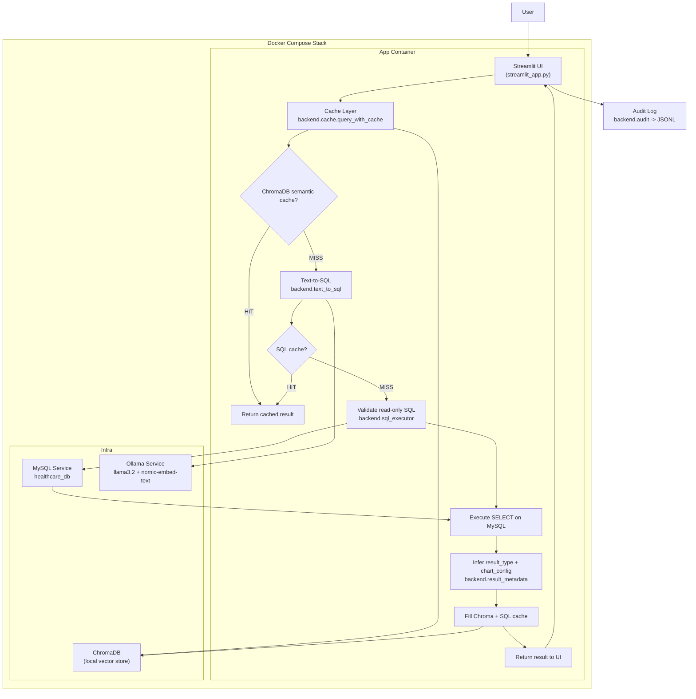

# Architecture

This document describes the end-to-end architecture of the Healthcare AI Assistant.

## High-level data flow

## Components

- **UI (Streamlit)**
  - File: `streamlit_app.py` (also exposed as `healthcare_ai.ui.streamlit_app`).
  - Renders chat-style interface and visualizations based on `result_type`.

- **Cache layer**
  - File: `backend/cache.py`.
  - Orchestrates:
    - Semantic cache (ChromaDB).
    - In-memory SQL cache.
    - Calls into text-to-SQL, SQL execution, result metadata, and audit.

- **Text-to-SQL**
  - File: `backend/text_to_sql.py`.
  - Uses LangChain + Ollama (`llama3.2`) with schema-only context (`backend/schema.py`) to generate a single `SELECT`.

- **SQL execution and safety**
  - File: `backend/sql_executor.py`.
  - Normalizes SQL, validates read-only, executes against MySQL via PyMySQL.

- **Result metadata**
  - File: `backend/result_metadata.py`.
  - Infers `result_type` and `chart_config` from the returned rows.

- **Semantic cache**
  - Backed by ChromaDB, using embeddings from `nomic-embed-text` served by Ollama.
  - Stores and retrieves previous question/response pairs.

- **MySQL**
  - Seeded by `docker/mysql/01-init.sql` and `docker/mysql/03-seed-100.sql`.
  - Exposes a read-only user created by `docker/mysql/02-readonly-user.sql`.

- **Ollama**
  - Runs locally in a Docker container.
  - Hosts `llama3.2` for text generation and `nomic-embed-text` for embeddings.

- **Audit log**
  - File: `backend/audit.py`.
  - Writes JSONL records with non-PII metadata about each query.

## Deployment (Docker Compose)

`docker-compose.yml` defines three main services:

- `app` – builds from `Dockerfile`, runs the Streamlit UI and backend.
- `mysql` – MySQL 8.0 with initialization scripts under `docker/mysql/`.
- `ollama` – Ollama server for LLM and embeddings.

Running `docker compose up -d` from the repo root brings up the full stack for local or demo use.

